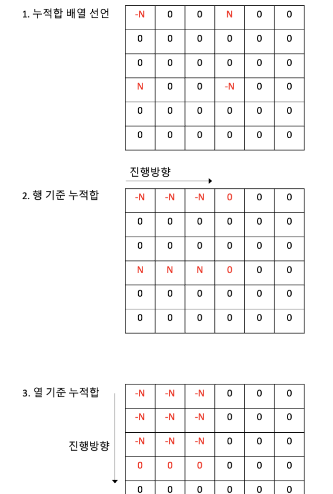

# 🔎 파괴되지 않은 건물

https://school.programmers.co.kr/learn/courses/30/lessons/92344

## 💡 아이디어

- 효율이 있는거 봐서 이중 for문보다는 누적합 방식을 활용한다.

## ✔ 문제풀이

> 누적합은 다음과 같은 그림을 보면 이해하기가 좀 더 수월하다.
> 

- 2차원 누적합을 다음과 같이 한다.
  - x1, y1, x2, y2가 주어질 때, (x1,y1) (x2+1,y2+1)는 값을 더하고 (x2+1, y1), (x1, y2+1)부분은 값을 뺴준다. 이렇게 하는 이유는 다음과 같기 때문
  - 값을 할당한 뒤에는 2중 for문을 각각 돌며 i,j 좌표에 (i-1, j), (i, j-1)좌표의 값을 더해준다.
  - 기존 board값에 누적합이 된 만큼 더해준뒤 0이상이면 answer+1을 해준다.

## 🤕 어려웠던 점

- 2차원 누적합 방식을 몰랐다. 배열에서만 할 줄 알아서 어디서 -를 하고 +를 해야하는지 헷갈렸다. <- 이거는 힌트를 보면서 했다.
